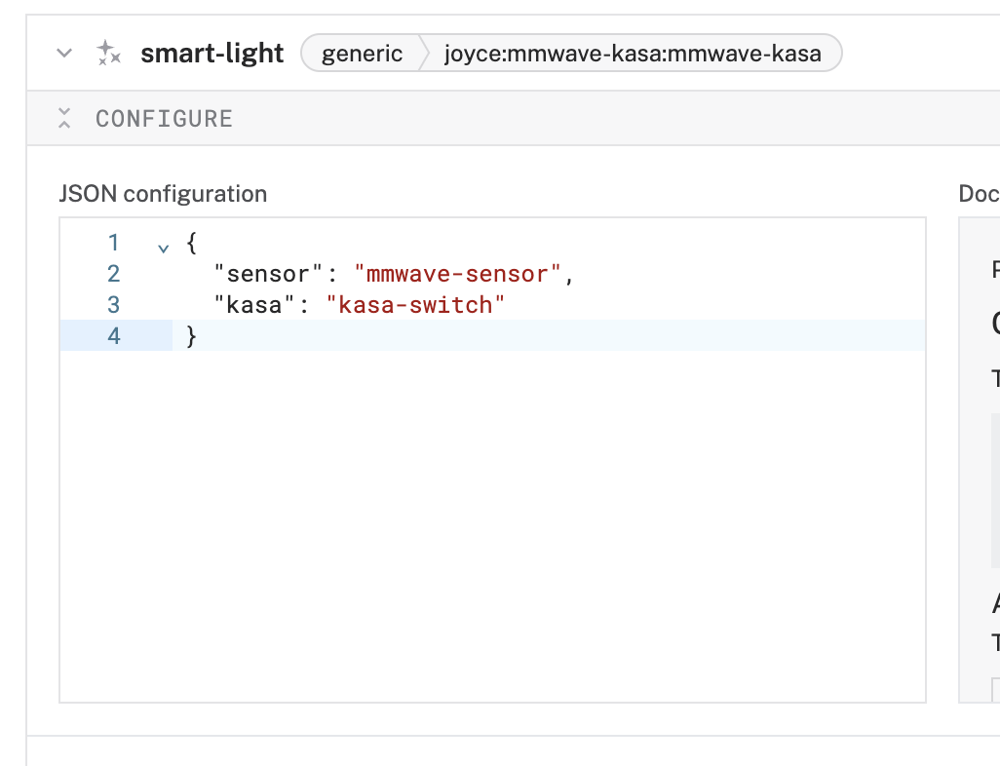

# Module mmwave-kasa 

The [`mmwave-kasa`](https://app.viam.com/module/joyce/mmwave-kasa) module uses an LD2410C mmwave sensor to detect presence to turn on and off a TP-link Kasa smart plug.

## Model joyce:mmwave-kasa:mmwave-kasa

Turn on a light when you enter a room, and turn it off when you leave. This uses an LD2410C mmwave sensor and Tp-Link Kasa smart plug.

### Configuration
The following attribute template can be used to configure this model:

```json
{
"sensor": <float>,
"kasa": <string>
}
```

#### Attributes

The following attributes are available for this model:

| Name          | Type   | Inclusion | Description                |
|---------------|--------|-----------|----------------------------|
| `sensor` | string  | Required  | The name of the mmwave sensor component in the Viam app|
| `kasa` | string | Required  | The name of the Kasa generic component in the Viam app |

#### Example Configuration

```json
{
  "sensor": "mmwave-sensor",
  "kasa": "kasa-switch"
}
```

